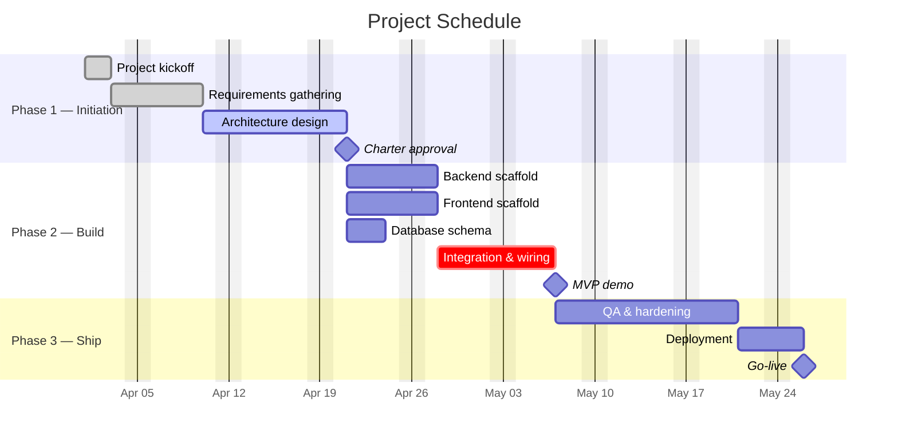

# PROJECT.md — Project Management Log

> This document follows **PMBOK 7th Edition** structure. It is the single source of truth for project status, decisions, and lessons, and is maintained by Claude Code throughout the project lifecycle.

---

## Project Identification

| Field | Value |
|---|---|
| **Project Name** | _[fill in]_ |
| **Project ID** | _[e.g., ORG-YYYY-NNN]_ |
| **Project Manager** | _[name]_ |
| **Sponsor / Owner** | _[executive sponsor]_ |
| **Start Date** | _[YYYY-MM-DD]_ |
| **Planned End Date** | _[YYYY-MM-DD]_ |
| **Status** | _[Planning / In Progress / On Hold / Complete / Cancelled]_ |
| **Last Updated** | _[YYYY-MM-DD]_ |
| **Repository** | _[git URL if applicable]_ |

---

## Key Performance Indicators

Top-line metrics that summarize project health at a glance.

| KPI | Current | Target |
|---|---|---|
| _[e.g., Features shipped]_ | _0_ | _10_ |
| _[e.g., Test coverage]_ | _0%_ | _80%_ |
| _[e.g., Active users]_ | _0_ | _100_ |

---

## Contents

1. [Project Charter](#1-project-charter)
2. [Scope Statement](#2-scope-statement)
3. [Work Breakdown Structure (WBS)](#3-work-breakdown-structure-wbs)
4. [Schedule & Milestones](#4-schedule--milestones)
5. [Deliverables Register](#5-deliverables-register)
6. [Cost Management](#6-cost-management)
7. [Risk Register](#7-risk-register)
8. [Issue Log](#8-issue-log)
9. [Change Log](#9-change-log)
10. [Lessons Learned](#10-lessons-learned)
11. [Current Status & Next Steps](#11-current-status--next-steps)

---

## 1. Project Charter

> **PMBOK:** Integration Management — Develop Project Charter

### 1.1 Project Purpose

_One paragraph: what problem are we solving and why does it matter to the business?_

### 1.2 Business Objectives

- _[Measurable business outcome]_
- _[Measurable business outcome]_
- _[Measurable business outcome]_

### 1.3 Key Stakeholders

| Role | Name / Team | Interest |
|---|---|---|
| Sponsor | _[name]_ | _[what they care about]_ |
| End users | _[group]_ | _[what they care about]_ |
| Technical lead | _[name]_ | _[interest]_ |
| _[other role]_ | _[name]_ | _[interest]_ |

### 1.4 Success Criteria

_Specific, measurable, and testable conditions that define "project succeeded"._

- _[Criterion 1]_
- _[Criterion 2]_
- _[Criterion 3]_

### 1.5 Assumptions & Constraints

| Type | Statement |
|---|---|
| Assumption | _[e.g., API access remains available for the duration of the project]_ |
| Constraint | _[e.g., Fixed budget of $X]_ |
| Constraint | _[e.g., Must ship by end of Q2]_ |
| Constraint | _[e.g., Single developer working part-time]_ |

---

## 2. Scope Statement

> **PMBOK:** Scope Management — Define Scope

### 2.1 In Scope

| Work Package | Description |
|---|---|
| WP1: _[Name]_ | _[What's included]_ |
| WP2: _[Name]_ | _[What's included]_ |
| WP3: _[Name]_ | _[What's included]_ |

### 2.2 Out of Scope

Explicitly excluded to prevent scope creep:

- _[Excluded item 1]_
- _[Excluded item 2]_
- _[Excluded item 3]_

### 2.3 Acceptance Criteria (Definition of Done)

Conditions every deliverable must meet before it is considered complete:

- _[Criterion 1 — e.g., All unit tests passing]_
- _[Criterion 2 — e.g., Documentation updated]_
- _[Criterion 3 — e.g., Reviewed by stakeholder]_

---

## 3. Work Breakdown Structure (WBS)

> **PMBOK:** Scope Management — Create WBS

Hierarchical decomposition of work. Parent rows group tasks; child rows are actionable units.

| WBS # | Work Package / Task | Description | Owner | Status |
|---|---|---|---|---|
| 1.0 | **_[Phase 1 Name]_** | _[Overall phase goal]_ | _[lead]_ | [In Progress] |
| 1.1 | _[Sub-task]_ | _[What it involves]_ | _[who]_ | [Pending] |
| 1.2 | _[Sub-task]_ | _[What it involves]_ | _[who]_ | [Pending] |
| 1.3 | _[Sub-task]_ | _[What it involves]_ | _[who]_ | [Pending] |
| 2.0 | **_[Phase 2 Name]_** | _[Overall phase goal]_ | _[lead]_ | [Pending] |
| 2.1 | _[Sub-task]_ | _[What it involves]_ | _[who]_ | [Pending] |
| 2.2 | _[Sub-task]_ | _[What it involves]_ | _[who]_ | [Pending] |

**Status values:** `[Pending]` `[In Progress]` `[Complete]` `[Deferred]` `[Blocked]` `[Cancelled]`

---

## 4. Schedule & Milestones

> **PMBOK:** Schedule Management

**Planned Duration:** _[start date — end date]_
**Actual Duration:** _[start date — end date, fill in on close]_

### 4.1 Milestone List

| Date | Milestone | Description | Status |
|---|---|---|---|
| _YYYY-MM-DD_ | Project Initiation | _[Kickoff notes]_ | [Done] |
| _YYYY-MM-DD_ | _[Milestone name]_ | _[What was delivered]_ | [Done] |
| _YYYY-MM-DD_ | _[Milestone name]_ | _[What's happening now]_ | [Active] |
| _TBD_ | _[Milestone name]_ | _[What's planned]_ | [Future] |

### 4.2 Gantt Chart

Rendered as a Mermaid diagram — GitHub, VS Code, and Obsidian render this natively.
Keep the task IDs stable (p1t1, p1t2, …) so dependencies (`after p1t1`) keep working when tasks are re-ordered.

**Task status markers** (prefix before task ID):
- `done,` — task completed
- `active,` — task currently in flight
- `crit,` — task is on the critical path
- `milestone,` — zero-duration milestone marker
- _(no prefix)_ — planned / future task

**Dependency syntax:**
- `after p1t2` — starts when p1t2 finishes
- `after p2t1 p2t2 p2t3` — starts when all three finish (AND)
- `2026-05-01, 5d` — fixed start date with 5-day duration
- `after p1t1, 3d` — 3-day duration starting after p1t1

---

## 5. Deliverables Register

> **PMBOK:** Integration / Scope Management

Every tangible output the project produces. Assign a stable ID (D1, D2, …) — never reused.

| ID | Deliverable | Location / Artifact | Format | Owner | Status |
|---|---|---|---|---|---|
| D1 | _[Name]_ | _[path or URL]_ | _[CSV / XLSX / PDF / HTML / Source Code]_ | _[who]_ | [Delivered] |
| D2 | _[Name]_ | _[path or URL]_ | _[format]_ | _[who]_ | [In Progress] |
| D3 | _[Name]_ | _TBD_ | _[format]_ | _[who]_ | [Planned] |

**Status values:** `[Planned]` `[In Progress]` `[Delivered]` `[Accepted]` `[Deferred]`

---

## 6. Cost Management

> **PMBOK:** Cost Management — Estimate, Budget, Control Costs

### 6.1 One-Time Costs

| Activity | Category | Cost | Basis |
|---|---|---|---|
| _[e.g., API classification run]_ | API | _$X_ | [Actual] / [Estimated] |
| _[e.g., Initial data ingest]_ | Compute | _$X_ | [Estimated] |
| _[e.g., Design / research]_ | Labor | _$X_ | [Estimated] |
| **Total one-time** |  | **_$X_** |  |

### 6.2 Recurring Costs

| Component | Frequency | Per-period Cost | Monthly Estimate |
|---|---|---|---|
| _[e.g., API queries]_ | per day | _$X_ | _$Y_ |
| _[e.g., Hosting]_ | per month | _$X_ | _$X_ |
| **Monthly total** |  |  | **_$Z_** |

### 6.3 Infrastructure

| Item | Cost | Notes |
|---|---|---|
| _[e.g., Server / VM]_ | _$X/mo_ | _[What it hosts]_ |
| _[e.g., Domain / SSL]_ | _[Existing / $X]_ | _[Notes]_ |
| _[e.g., Storage]_ | _[Cost]_ | _[Capacity]_ |

### 6.4 Budget vs. Actual

| Metric | Budget | Actual (to date) | Variance |
|---|---|---|---|
| One-time | _$X_ | _$Y_ | _±$Z_ |
| Recurring (annualized) | _$X_ | _$Y_ | _±$Z_ |

---

## 7. Risk Register

> **PMBOK:** Risk Management — Identify, Analyze, Plan Response

| ID | Risk Description | Impact if Realized | Likelihood | Severity | Mitigation | Status |
|---|---|---|---|---|---|---|
| R1 | _[Risk statement]_ | _[Consequence]_ | [Low/Med/High] | [Low/Med/High] | _[How we reduce it]_ | [Open] |
| R2 | _[Risk statement]_ | _[Consequence]_ | [Low/Med/High] | [Low/Med/High] | _[Mitigation]_ | [Mitigated] |

**Severity scale:**
- **Low** — minor slippage, no lasting damage
- **Medium** — delayed milestone, budget overrun, partial rework
- **High** — project failure, major rework, customer-visible outage

**Status values:** `[Open]` `[Monitoring]` `[Mitigated]` `[Realized]` `[Closed]` `[Planned]`

---

## 8. Issue Log

> **PMBOK:** Integration Management — active problems requiring resolution.

| ID | Date Raised | Issue | Impact | Resolution | Status |
|---|---|---|---|---|---|
| I1 | _YYYY-MM-DD_ | _[What went wrong]_ | _[What it blocked or broke]_ | _[How it was fixed]_ | [Resolved] |
| I2 | _YYYY-MM-DD_ | _[Issue]_ | _[Impact]_ | _[In progress...]_ | [Open] |

**Status values:** `[Open]` `[In Progress]` `[Resolved]` `[Won't Fix]` `[Duplicate]`

> **Rule:** Never delete resolved issues. Historical record matters. Mark as resolved and leave the row.

---

## 9. Change Log

> **PMBOK:** Integration Management — Perform Integrated Change Control

Formal record of any approved change to scope, cost, schedule, quality, or resources.

| ID | Date | Change | Reason | Impact | Approved By |
|---|---|---|---|---|---|
| C1 | _YYYY-MM-DD_ | _[What changed]_ | _[Why it changed]_ | _[Effect on scope / cost / schedule / quality]_ | _[name]_ |
| C2 | _YYYY-MM-DD_ | _[Change]_ | _[Reason]_ | _[Impact]_ | _[name]_ |

---

## 10. Lessons Learned

> **PMBOK:** Integration Management — Close Phase / Project

| Date | Category | Lesson | Recommendation |
|---|---|---|---|
| _YYYY-MM-DD_ | _[API / Cost / Memory / Architecture / Data Quality / Scope / Process]_ | _[What we learned]_ | _[What to do differently next time]_ |
| _YYYY-MM-DD_ | _[Category]_ | _[Lesson]_ | _[Recommendation]_ |

---

## 11. Current Status & Next Steps

> **PMBOK:** Communications Management — Status Reporting

### 11.1 Current Status (as of _YYYY-MM-DD_)

> **[Status color]** — _[One-line headline: where are we right now?]_
>
> _[Two or three sentences of context: what's in flight, what just finished, what's about to start.]_

### 11.2 Work Package Progress

| Work Package | Progress | Status |
|---|---|---|
| WP1: _[Name]_ | _[X / Y (Z%)]_ | [Complete] |
| WP2: _[Name]_ | _[Progress]_ | [In Progress] |
| WP3: _[Name]_ | _[Not started]_ | [Pending] |

### 11.3 Next Steps

Concrete, ordered actions. Use priority levels to help triage.

| # | Action | Owner | Priority | Target Date |
|---|---|---|---|---|
| 1 | _[Specific next action]_ | _[who]_ | [Critical] | _YYYY-MM-DD_ |
| 2 | _[Next action]_ | _[who]_ | [High] | _YYYY-MM-DD_ |
| 3 | _[Next action]_ | _[who]_ | [Medium] | _TBD_ |

**Priority scale:** `[Critical]` `[High]` `[Medium]` `[Low]`

### 11.4 Technology Stack

| Layer | Technology | Version / Notes |
|---|---|---|
| Frontend | _[e.g., Vue 3 + Vite]_ | _[version]_ |
| Backend | _[e.g., FastAPI + SQLAlchemy 2 async]_ | _[version]_ |
| Database | _[e.g., PostgreSQL 16]_ | _[Docker / managed]_ |
| Styling | _[e.g., EZ Design System]_ | _[tokens.css]_ |
| Infrastructure | _[e.g., Docker Compose]_ | _[notes]_ |
| Deployment | _[e.g., Tailscale Funnel]_ | _[notes]_ |
| External APIs | _[list]_ | _[purpose]_ |

### 11.5 Architecture Decisions

Key technical decisions with rationale, to prevent revisiting settled questions.

| Date | Decision | Rationale | Alternatives Considered |
|---|---|---|---|
| _YYYY-MM-DD_ | _[Decision]_ | _[Why]_ | _[What else was on the table]_ |

---

## Maintenance Instructions (for Claude Code)

This file is the project's living PMI/PMBOK artifact. Claude Code is responsible for keeping it accurate.

### When to update which section

| Trigger | Section(s) to update |
|---|---|
| Starting a new project | Project Identification, §1 Charter, §2 Scope, §3 WBS, §11.4 Tech Stack |
| Completing a phase or milestone | §3 WBS (status), §4 Schedule (new row), §11.1 Current Status, §11.2 WP Progress |
| Delivering an artifact | §5 Deliverables Register |
| Making an architecture or scope change | §9 Change Log, §11.5 Architecture Decisions, §2 Scope if in/out shifts |
| Incurring or forecasting cost | §6 Cost Management |
| Identifying a new risk | §7 Risk Register |
| Encountering a bug or blocker | §8 Issue Log (create row) |
| Resolving a bug or blocker | §8 Issue Log (update status + resolution) |
| Ending a session with a new insight | §10 Lessons Learned |
| Every session | `Last Updated` date in header, §11.3 Next Steps |

### Rules

1. **Never delete historical entries.** Issues, risks, changes, and deliverables accumulate. Mark them resolved or closed but keep the row. The audit trail is the point.
2. **IDs are stable and never reused.** Once `R3` or `I7` or `D5` is assigned, that ID is retired even if the item is closed. The next new item gets the next unused number.
3. **Dates are absolute (YYYY-MM-DD).** Never "yesterday", "last week", "TBD this quarter". If you don't know the exact date, write `TBD` literally.
4. **No filler text.** Every row in every table should be useful to someone reading this file cold. If a section has no entries yet, leave it with the placeholder example and a note that it's empty — don't pad.
5. **Tables use standard markdown.** This file must render correctly on GitHub, VS Code, and Obsidian.
6. **Status labels use brackets** (e.g., `[In Progress]`, `[Mitigated]`) for uniform parsing. Full list in each section.
7. **Update the `Last Updated` date in the header every time you touch this file.**
